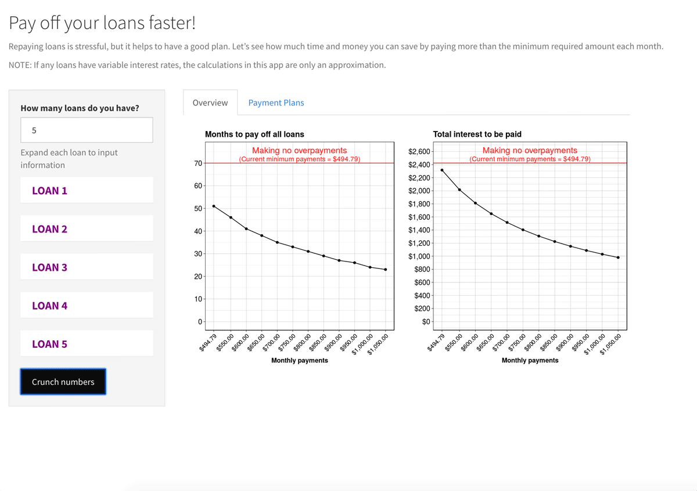

# Why overpay on your loans?

Have student loans, car loans, or a mortgage? Want to understand how much time and money you can save by making overpayments? 

If you are like me, you have been told that overpaying on your loans will "help out a lot" or "make a big difference" but you struggle to set aside the funds for overpayments without knowing just *exactly* how much you will save. With this application, you no longer have to be in the dark! 

Simply enter your loan information, including loan balances, interest rates, and minimum monthly payments. You will then be given an overview of how more quickly you can pay off your loans and how much money you can save in interest. You can also look at specific overpayment plans to get a sense for how loan payments and loan balance will look over time. 

## Technical details

The hardest part in developing this app was writing the underlying calculator using principles of finance and ammoritization loans. However, I spent the most time developing a functional UI. While the calculations themselves are complicated and boring, I wanted the user to be able to see only what they needed to know:

1. How much time and money can they save for varying levels of overpayment
2. Given a level of overpayment that the user is comfortable with, what their payments and balance will look like over time

Some special Shiny features that I took advantage of were:

* `insert_UI`, `remove_UI`, and `render_UI`
* `accordian` from the *shinydashboardPlus* library
* `validate` to give proper error messages
* `withProgress` for the user to see a progress bar

## Links

[RStudio Cloud project](https://rstudio.cloud/project/212656)

[Application](https://jmaddalena.shinyapps.io/loans_calc/)
